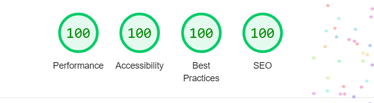

# Clipboard - history of everything!

Clipboard allows you to track and organize everything you copy.
Instantly access your clipboard on all your devices.

## Installation

A step by step guide that will tell you how to get the development environment up and running.

```
$ Clone the repositiorium.
$ Open using Firefox or something else.
$ If using IDE, turn on live server.
```

## Ligthhouse statistics

<p> Desktop </p>



</br>
</br>

<p> Mobile </p>


